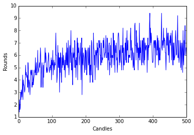
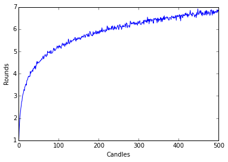
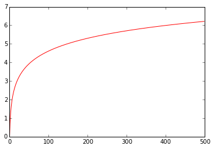
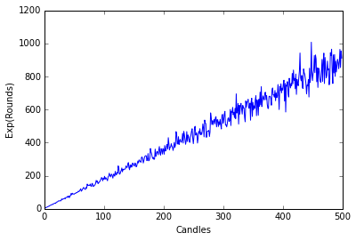
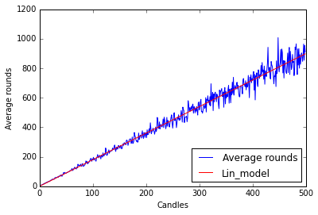
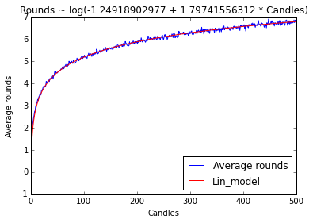

In the [last post](http://eardil.github.io/2015/08/19/first-crawl/) I defined a function that perform simulations for the birthday candle problem. This time I want to use it to visualize what happens if I change the parameters of the problem by using this function:

    import numpy as np
    
    def candles(n,M):
        Kj=np.zeros(M)
        for j in range(0,M):
            ni=n
            k=0
            while ni>=1:
                ni=ni-np.random.random_integers(1,ni)
                k+=1
            Kj[j]=k
        return np.mean(Kj)

There are several libraries for the things I will do here today (plotting and modelling), but today I'll use the most straightforward ones. In later posts I plan to learn and write about the other libraries more specifically.

## Plotting
I need to load another library, which is the "standard" one for plotting and it's called `matplotlib`. The second line is for the graphs to appear right here instead of in a new window.

    import matplotlib.pyplot as plt
    %matplotlib inline

Let's begin by generating for candles from $$1$$ to $$500$$ and sampling 5 times.

    M=5
    N=500
    
    K=np.zeros(N)
    for n in range(1,N+1):
        K[n-1]=candles(n,M)

For plotting, you "create" the plot, then make customizations (like labels and colors), and then you `show` it.

    plt.plot(K)
    plt.ylabel('Rounds')
    plt.xlabel('Candles')
    plt.show()

Nice enough. But looks kinda noisy. I'll change the number of samples per run to $$M=1000$$.

    M=1000
    N=500
    
    K=np.zeros(N)
    for n in range(1,N+1):
        K[n-1]=candles(n,M)
    
    plt.plot(K)
    plt.ylabel('Rounds')
    plt.xlabel('Candles')
    plt.show()

It looks kinda logarithmic. But don't trust my word for it, lets see the graph of the natural logaritm.

    plt.plot(np.log(range(1,500)),'r')

    [<matplotlib.lines.Line2D at 0x6ad6978>]

That means we could try to adjust a linear model to the exponential of $$K$$.

## Modelling

First let's see that $$e^K$$ looks indeed linear:

    plt.plot(np.exp(K),label="Exp(K)")
    plt.ylabel('Exp(Rounds)')
    plt.xlabel('Candles')
    plt.show()

Now we need a library for statistical modelling, so lets call `scipy` and it's `stats` package.

    from scipy import stats as stat

Now I'll perform linear regression on $$e^K$$. This means that I'm trying to find numbers $$a,b$$ such that $$e^K = a\times n+b$$ plus some noise.

    lin_K = stat.linregress(range(1,N+1), y=np.exp(K))
    print(lin_K)

    LinregressResult(slope=1.7974155631156676, intercept=-1.2491890297652617, rvalue=0.99070255893402914, pvalue=0.0, stderr=0.011060517470059619)
    

It seems it didn't crash, so let's try to plot it

    plt.plot(np.exp(K),label="Average rounds")
    plt.plot(lin_K.intercept+lin_K.slope*range(1,N+1),label="Lin_model",color='r')
    plt.ylabel('Average rounds')
    plt.xlabel('Candles')
    plt.legend(loc=4)
    plt.show()

Pretty neat, although I would prefer a linear regression function with some kind of predict function or fitted values but I'll leave that for other post.

### Final graph and thoughts
By transforming back to the logarithm I get the final product:

    plt.plot(K,label="Average rounds")
    plt.plot(np.log(lin_K.intercept+lin_K.slope*range(1,N+1)),label="Lin_model",color='r')
    plt.ylabel('Average rounds')
    plt.xlabel('Candles')
    plt.title("Rounds ~ log(%s + %s * Candles)" % (lin_K.intercept,lin_K.slope))
    plt.legend(loc=4)
    plt.show()

---

Remember that you can get this [IPython Notebook](https://github.com/eardil/Blog_Code/blob/master/2015-08-22-second-crawl/2015-08-22-second-crawl.ipynb) and others at my [Github Page](https://github.com/eardil).

